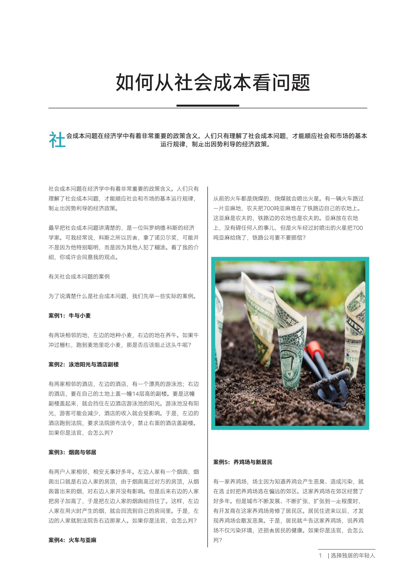
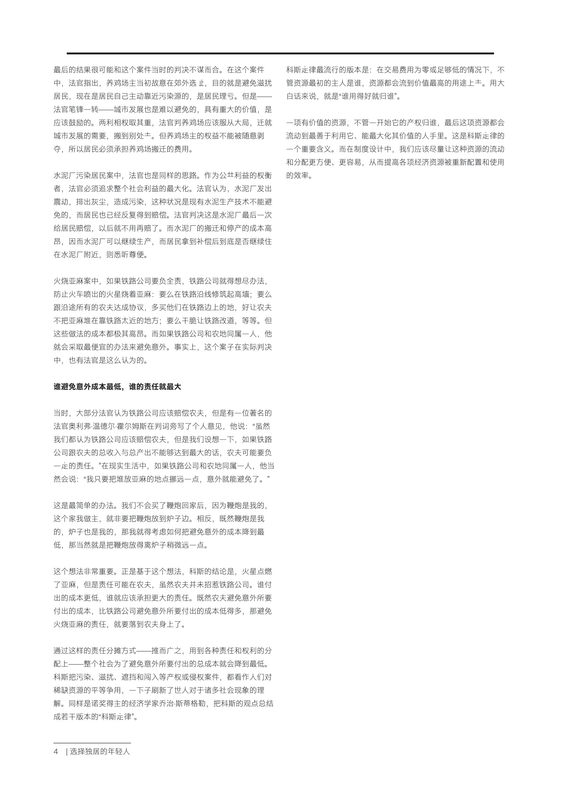

# DLArtiset - An Intelligent Typesetting System

🏆 The second prize of the 12th National College Student Software Innovation Competition (12th Intel Cup)

## Introduction

DLArtist is an artificial intelligence-based typesetting website that automatically typeset articles entered by users, intelligently crop images, and provide automatic generation of illustrations.

Read this in other languages: [English](README.md), [中文](README-CN.md)

## Deployment

### Requirements

```
1. Ubuntu 16.04+
2. nginx
3. swoole
4. mysql 5.5+
5. php 7.1+
6. composer
7. npm
8. python 2.7 & python 3.6
```

### CRON Configuration

```sh
# open cron directory
crontab -e

Here is the only Cron entry you need to add to your server:

* * * * * php /path/to/artisan schedule:run >> /dev/null 2>&1

This Cron will call the Laravel command scheduler every minute. Then, Laravel evaluates your scheduled tasks and runs the tasks that are due.
```

### .env configuration
```
APP_NAME=DLArtist
APP_ENV=local
APP_KEY=
APP_DEBUG=true
APP_URL=http://localhost

LOG_CHANNEL=stack

DB_CONNECTION=mysql
DB_HOST=127.0.0.1
DB_PORT=3306
DB_DATABASE=
DB_USERNAME=
DB_PASSWORD=

BROADCAST_DRIVER=log
CACHE_DRIVER=redis
QUEUE_CONNECTION=sync
SESSION_DRIVER=file
SESSION_LIFETIME=120

REDIS_HOST=127.0.0.1
REDIS_PASSWORD=null
REDIS_PORT=6379

MAIL_DRIVER=smtp
MAIL_HOST=smtp.163.com
MAIL_PORT=465
MAIL_USERNAME=dlartist@163.com
MAIL_PASSWORD=dlartist123
MAIL_ENCRYPTION=ssl
MAIL_FROM_ADDRESS=dlartist@163.com
MAIL_FROM_NAME=goodfellow

PUSHER_APP_ID=
PUSHER_APP_KEY=
PUSHER_APP_SECRET=
PUSHER_APP_CLUSTER=mt1

MIX_PUSHER_APP_KEY="${PUSHER_APP_KEY}"
MIX_PUSHER_APP_CLUSTER="${PUSHER_APP_CLUSTER}"

```

### Install

1. Clone the project to your local directory
2. Use `cd` to go to the project folder in your terminal
3. Run `composer install` in your terminal
4. Copy the `.env.example` file to the `.env` file in the project home directory
5. Open the `.env` file and change DB_DATABASE to your corresponding database name, DB_USERNAME to the corresponding database user name, DB_PASSWORD to the corresponding user password
6. Run `php artisan key:generate`
7. Run `php artisan migrate`
8. Run `php artisan serve`
9. Browser access `localost:8000`

## Results
Sample 1





More samples can be found in `assets`.

Please contact chuyangzhao@126.com for more information.
